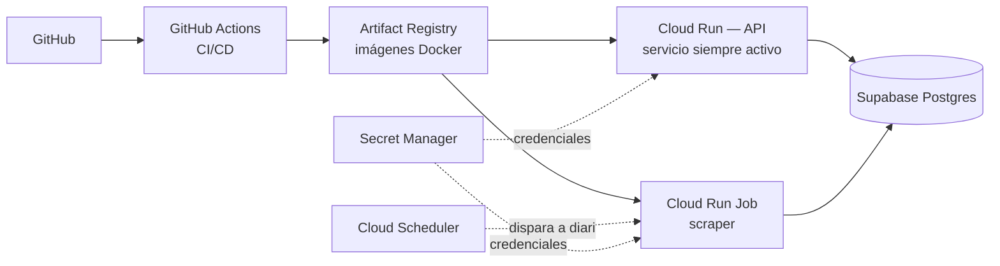

# PriceHunter — Comparador de precios (backend)

API en NestJS que compara y rastrea precios de productos en Amazon, Mercado Libre y Liverpool mediante scraping con Puppeteer, desplegada en infraestructura serverless de Google Cloud.

## Arquitectura



**Por qué esta arquitectura y no un solo servidor "todo en uno":**

El proyecto empezó como un monolito NestJS con un `@Cron` interno que disparaba el scraping a medianoche. Esto funciona en un servidor tradicional (Railway, una VM), pero **no es confiable en un entorno serverless** como Cloud Run: el servicio escala a cero cuando no hay tráfico HTTP, así que un cron interno podría simplemente no ejecutarse nunca.

La solución fue separar responsabilidades:
- **Cloud Run (servicio)** — solo atiende requests HTTP de la API. Escala a cero cuando nadie lo usa, lo cual es ideal para costos.
- **Cloud Run Job** — un proceso de un solo uso que corre el scraping y termina. No depende de que el servicio esté "despierto".
- **Cloud Scheduler** — dispara el Job en un horario fijo, de forma completamente independiente del tráfico de la API.

Ambos (servicio y Job) comparten la misma imagen Docker; el comportamiento se decide en runtime con la variable de entorno `MODE` (ver `entrypoint.sh`).

## Decisiones técnicas y problemas resueltos

Esta sección documenta los problemas reales que surgieron al mover un proyecto local a producción cloud — y cómo se resolvieron.

| Problema | Causa | Solución |
|---|---|---|
| El cron interno no corría en Cloud Run | El servicio escala a cero sin tráfico | Se movió el scraping a un Cloud Run Job disparado por Cloud Scheduler |
| `Error: The server does not support SSL connections` en local | La conexión forzaba SSL basándose solo en si existía `DATABASE_URL`, sin distinguir entorno | Se separó el control de SSL a su propia variable (`DB_SSL`), independiente de si hay `DATABASE_URL` |
| Timeouts de navegación con Puppeteer en la nube | Los sitios objetivo responden más lento (o detectan distinto) a tráfico desde IPs de datacenter que desde una IP residencial | Se subió el timeout del Cloud Run Job de 600s a 1800s, y se subió la memoria asignada a 1Gi |
| Credenciales expuestas en texto plano en variables de entorno | Configuración inicial simple para validar el deploy | Se migraron `DATABASE_URL` y `CRON_SECRET` a Secret Manager, con acceso restringido por IAM a la cuenta de servicio del proyecto |
| Migración de datos entre proveedores (Railway → Supabase) | Railway retiró su tier gratuito de Postgres | Migración con `pg_dump`/`pg_restore` vía Docker, usando el modo *pooler* de Supabase (IPv4) en vez de la conexión directa (IPv6) para compatibilidad de red |

## Stack técnico

- **Backend:** NestJS, TypeScript, TypeORM
- **Scraping:** Puppeteer + Chromium (contenedor Docker con dependencias del sistema instaladas)
- **Base de datos:** PostgreSQL en Supabase (con connection pooling vía Supavisor)
- **Infraestructura:** Google Cloud Run (servicio + Job), Cloud Scheduler, Artifact Registry, Secret Manager
- **CI/CD:** GitHub Actions — build, push y deploy automático en cada push a `main`

## Correr el proyecto en local

Requiere Docker y Docker Compose.

```bash
# Levantar la API + Postgres local
docker compose up --build

# Simular el Job de scraping (corre una vez y termina)
docker compose --profile job run --rm job
```

La API queda disponible en `http://localhost:3000`.

## Variables de entorno

| Variable | Descripción |
|---|---|
| `DATABASE_URL` | Connection string de Postgres |
| `DB_SSL` | `"true"` en la nube, `"false"` en local |
| `CRON_SECRET` | Protege el endpoint de scraping manual contra llamadas no autorizadas |
| `MODE` | `"job"` para correr el scraper una vez y salir; sin definir, corre el servidor API |

## Endpoints principales

| Método | Ruta | Descripción |
|---|---|---|
| `POST` | `/scrape` | Compara precios de un producto dado un set de URLs |
| `POST` | `/scrape/search` | Busca un producto por nombre en las 3 tiendas |
| `GET` | `/scrape/history` | Historial completo de precios rastreados |
| `GET` | `/scrape/history/:id` | Historial de un producto específico |
| `GET` | `/scrape/price-drops` | Productos con caída reciente de precio |
| `POST` | `/scrape/update-all` | Dispara la actualización completa (protegido con `x-cron-secret`) |

## CI/CD

Cada push a `main` que modifique `backend/` dispara `.github/workflows/deploy.yml`, que:
1. Construye la imagen Docker
2. La sube a Artifact Registry
3. Actualiza el servicio de Cloud Run
4. Actualiza el Cloud Run Job con la misma imagen

Un segundo workflow, `.github/workflows/scheduled-scrape.yml`, corre independientemente todos los días para disparar la actualización de precios.
